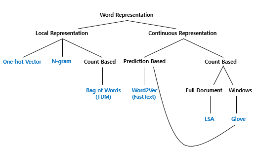
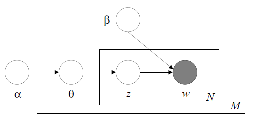

#-*-coding:utf-8-*-
# Analysis of South Korean Journalism Framing on COVID-19 and 21st South Korea General Election:
## Big Data, Word Embeddings, and Sentiment Analysis Leveraging

단어의 표현 방법은 크게 국소 표현(Local representation) 방법과 분산 표현(Distributed Representation) 방법으로 나뉜다. 국소 표현 방법은 해당 단어 그 자체만 보고, 특정 값을 맵핑하여 단어를 표현하는 방법이며, 분산 표현 방법은 그 단어를 표현하고자 주변을 참고하여 단어를 표현하는 방법이다.

반면, 분산 표현 방법의 예를 하나 들어보면 해당 단어를 표현하기 위해 주변 단어를 참고한다. puppy(강아지)라는 단어 근처에는 주로 cute(귀여운), lovely(사랑스러운)이라는 단어가 자주 등장하므로, puppy라는 단어는 cute, lovely한 느낌이다로 단어를 정의한다. 이렇게 되면 이 두 방법의 차이는 국소 표현 방법은 단어의 의미, 뉘앙스를 표현할 수 없지만, 분산 표현 방법은 단어의 뉘앙스를 표현할 수 있게 된다.

또한 비슷한 의미로 국소 표현 방법(Local Representation)을 이산 표현(Discrete Representation)이라고도 하며, 분산 표현(Distributed Representation)을 연속 표현(Continous Representation)이라고도 한다.

다른 의견으로는, 구글의 연구원 토마스 미코로브(Tomas Mikolov)는 2016년 한 발표에서 LSA나 LDA와 같은 방법들은 단어의 의미를 표현할 수 있다는 점에서 연속 표현(Countinous Representation)이지만, 엄밀히 말해서 다른 접근의 방법론을 사용하고 있는 워드투벡터(Word2vec)와 같은 분산 표현(Distributed Representation)은 아닌 것으로 분류하여 연속 표현을 분산 표현을 포괄하고 있는 더 큰 개념으로 설명하기도 했다.

Glossary
코퍼스 = 말뭉치 = 분석하려는 대상, 문서, dataset
코퍼스 = 보통 여러 단어들로 이루어진 문장. 한가지 언어로 이루어진 코퍼스 = 단일 언어 코퍼스 (monolingual)
morph = 형태- 형태소(morpheme)의 구체적인 표형
##### Word Representaion

1. Bag of Words란?
Bag of Words란 단어들의 순서는 전혀 고려하지 않고, 단어들의 출현 빈도(frequency)에만 집중하는 텍스트 데이터의 수치화 표현 방법이다. Bag of Words를 직역하면 단어들의 가방이라는 의미이다. 단어들이 들어있는 가방을 상상해보자. 갖고있는 어떤 텍스트 문서에 있는 단어들을 가방에다가 전부 넣는다. 그러고나서 이 가방을 흔들어 단어들을 섞는다. 만약, 해당 문서 내에서 특정 단어가 N번 등장했다면, 이 가방에는 그 특정 단어가 N개 있게 된다. 또한 가방을 흔들어서 단어를 섞었기 떄문에 더 이상 단어의 순서는 중요하지 않는다.

N-gram Language Model
n-gram 언어 모델은 여전히 카운트에 기반한 통계적 접근을 사용하고 있으므로 SLM의 일종이다. 다만, 앞서 배운 언어 모델과는 달리 이전에 등장한 모든 단어를 고려하는 것이 아니라 일부 단어만 고려하는 접근 방법을 사용한다. 그리고 이때 일부 단어를 몇 개 보느냐를 결정해야하는데 이것이 n-gram에서의 n이 가지는 의미이다.

단어 문서 행렬(Term-Document Matrix, TDM)
단어문서행렬을 통한 방법이 일반적으로 많이 사용된다. 이를 위해 입력값이 데이터프레임인 경우 DataframeSource, 벡터인 경우 VectorSource를 사용하여 말뭉치(Corpus)로 변환하고, 이를 TermDocumentMatrix 함수에 넣어 단어문서행렬을 생성한다. 물론 텍스트를 바로 넣어 wfm 단어빈도행렬(Word Frequency Matrix)을 생성시켜 분석을 하기도 하지만 일반적인 방식은 아니다.

TermDocumentMatrix() 함수를 활용하여 단어가 문서에 출현하는 빈도수를 행렬로 저장한다. 행렬형태 데이터를 저장하게 되면 고급 통계 분석이 가능하게 된다. DocumentTermMatrix()는 TermDocumentMatrix() 함수로 통해 나온 행렬을 전치(transpose)시킨 것이다.
문서 단어 행렬(Document-Term Matrix, DTM) 단어문서행렬(Term Document Matrix)을 전치(Transpose)하게 되면 문서단어행렬(DTM)

0과 1밖에 모르는 기계에게 인간의 언어 알려줘야 하는데, 이유는 컴퓨터는 숫자만 인식할 수 있기 때문에 바이너리 코드로 처리해 줘야한다. 텍스트 데이터 즉, 순서가 없는 범주형 데이터를 수치형 데이터로 변환한다. 벡터에서 해당되는 하나의 데이터만 1로 변경해 주고 나머지는 0으로 채워주는 방식으로 원핫 인코딩(One-Hot Encoding), 통계학에서 가변수(Dummy Variable)처리라고 부른다.

언어 모델(Language Model)이란?
언어 모델(Language Model)은 짧게 요약하면 문장. 즉, 단어의 시퀀스의 확률을 예측하는 모델이다. 언어 모델은 자연어 생성(Natural Language Generation)의 기반이 된다. 기본적으로 자연어 생성과 관련된 건 모두 언어 모델과 관련이 있다. 음성 인식, 기계 번역, OCR, 검색어 자동 완성 등과 괕은 것은 전부 언어 모델을 통해 이루어진다. …

LSA : DTM을 차원 축소 하여 축소 차원에서 근접 단어들을 토픽으로 묶는다.
LDA : 단어가 특정 토픽에 존재할 확률과 문서에 특정 토픽이 존재할 확률을 결합확률로 추정하여 토픽을 추출한다.

##### Stemming
##### Stemming is the extraction of morphological analysis

#### • TF-IDF (Term Frequency – Inverse Document Frequency) 
#####  The frequency of words in a specific document is proportional to the increase, and the TF-IDF value increases as the number of documents containing the word for all documents decreases. Hence, The bigger the DF value, the lower the weight value of TF-IDF, the reciprocal value of the DF value becomes the IDF.
##### - TF-IDF = TF * IDF = TF (t, d) * IDF (t, D)
##### - TF (Term Frequency) The frequency of specific words extract in a document
##### - DF (Document Frequency) The frequency of document on specific word extract while in all documents
##### - IDF (Inverse Document Frequency) The frequency of document on specific word extract while in all documents

tf-idf 값은 특정 문서 내에서 단어 빈도가 높을 수록, -> 알파 값은 각 문서를 구성하는 토픽의 분포를 조절합니다.
전체 문서들엔 그 단어를 포함한 문서가 적을 수록 tf-idf 값이 높아지게 됩니다. -> 베타(혹은 에타) 값은 각 토픽을 구성하는 단어들의 분포를 조절합니다

따라서 이 값을 이용하여 모든 문서에 나타나는 흔한 단어들을 걸러내며, 특정 단어가 가지는 중요도를 알 수 있게 됩니다.

다음번엔 ElasticSearch에서 쓰였던 tf-idf 로직과, BM25 에 대해 정리 해 보도록 하겠습니다.

하이퍼 파라미터 수정
 
저희는 주제를 구성하는 단어들을 통해 추출된 주제가 어떤 주제인지를 유추할 수 있습니다. 하지만 추출된 주제들 중 중복된 단어들이 많기도 하고 어떤 주제인지 정확히 파악하기 힘든 주제들도 함께 추출되었습니다.

LDA는 확률 모델의 일종이기 때문에 많은 데이터가 필요합니다. 즉 문서의 길이가 길수록 보다 정확한 결과를 줍니다(이를 보완하기 위해 짧은 문장에서 주제를 추출하는 Biterm Topic Model이 최근에 발표되었습니다). 문서의 길이를 보완하기 위해서는 다른 리뷰들과 합치거나 리뷰의 길이를 조정하는 과정이 필요합니다. 저는 이를 해결하기 위해 리뷰 데이터를 구성하는 '공감수' 정보를 사용하였습니다. 리뷰의 공감수는 해당 리뷰가 전달하는 내용에 동일한 생각을 한 사람들의 숫자입니다. 따라서 동일한 내용이 공감수만큼 추가한다면 리뷰의 길이를 늘릴 수 있습니다. 본 리뷰 집합에서 공감수는 최대 1045의 값을 가집니다. 한 리뷰를 1045배 확장시킬 수는 없기 때문에 log2의 값으로 보정해 줍니다. 이 때공감수가 0인 경우를 고려해 1의 값을 더해줍니다.

docs['내용'] = docs.apply(lambda x: x['내용']*int(np.log2(2 + x['공감수'])), axis = 1)
 

또한 주제가  명확하게 추출되지 않은 다른 이유로는 하이퍼 파라미터가 적절하지 않게 주어진 것도 한 몫을 하고 있습니다. LDA에서는 사용자가 정의하는 3개의 하이퍼 파라미터가 있습니다. 하나는 토픽의 개수이고 나머지는 알파, 베타 값입니다. 아쉽게도 정확한 토픽의 개수를 구하는 방법은 아직 존재하지 않습니다(이는 K-means와 같은 클러스터링 기법들에서 나타나는 한계점과 같습니다). Preplexity나 cohernce와 같은 지표를 사용하기도 합니다만 이는 참고용이지 완전히 신용할 수는 없습니다. 결국 토픽 수를 조절하면서 최적의 결과를 보여주는 토픽 수를 찾아야 합니다.

알파 값은 각 문서를 구성하는 토픽의 분포를 조절합니다. 이 값이 1에 가까워질 수록 각 문서들은 비슷한 토픽들의 분포로 구성됩니다.

베타(혹은 에타) 값은 각 토픽을 구성하는 단어들의 분포를 조절합니다. 마찬가지로 이 값이 1에 가까워질 수록 토픽들은 비슷한 단어들의 분포로 구성됩니다. 사용자들은 이 값들을 조절해 분포의 정도를 조절할 수 있습니다.

Scikit-Learn의 LDA에서는 알파값은 doc_topic_prior 베타값은 doc_topic_prior로 입력됩니다. 

추가적으로 '게임', '모바일'등과 같이 전체 문서에서 너무 많이 등장하거나 너무 적게 등장한 단어들은 삭제해 줌으로써 보다 중요한 단어들이 토픽에 반영되도록 문서 단어 행렬을 구성해 줍니다.

이번에는 TF-IDF를 적용하지 않고 토픽 18개, 알파값 0.001, 베타값 0.01을 적용해 학습을 시켜보겠습니다. 또한 학습된 LDA 모델을 이후 분석에 사용하기 위해 pickle 파일로 저장해 놓겠습니다.